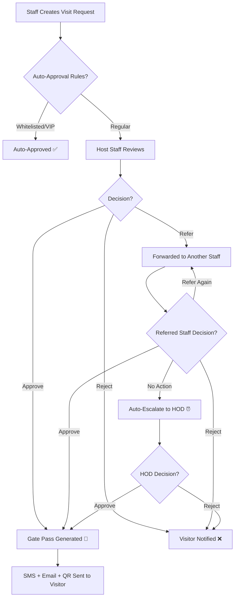
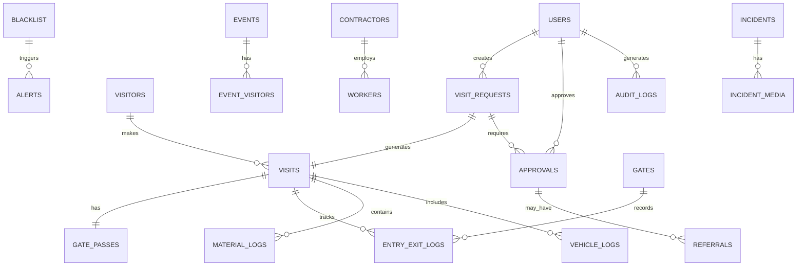
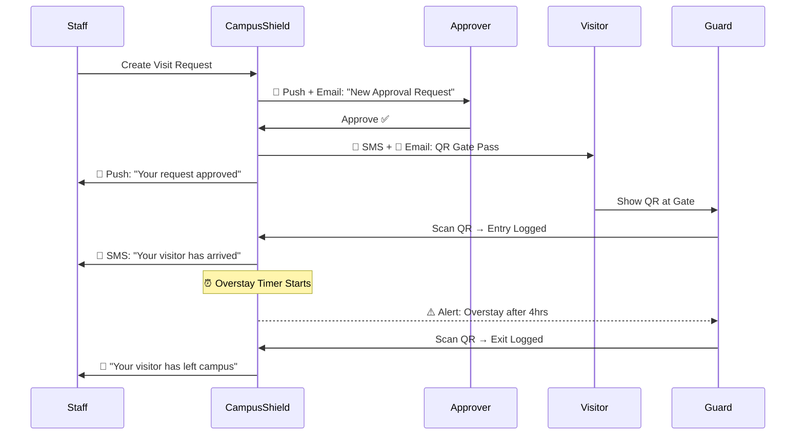
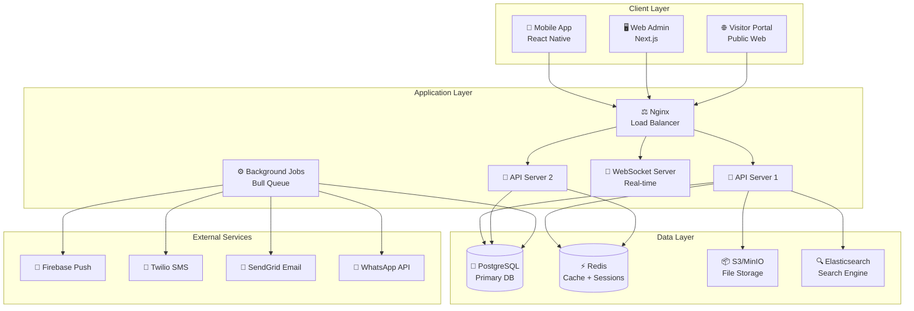
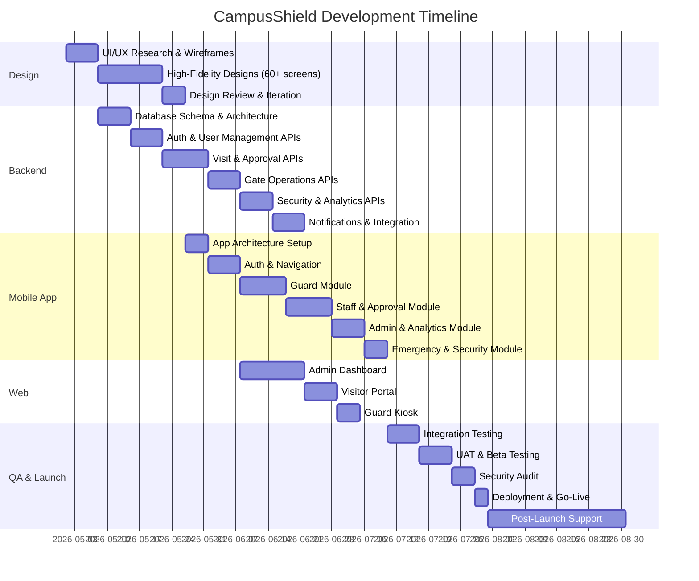

# 🛡️ CampusShield — Campus Gate Security Platform

## Complete Product Design Document | Budget: ₹15,00,000

---

## 1. Executive Summary

**CampusShield** is an enterprise-grade, end-to-end campus gate security platform that digitizes and automates every aspect of visitor management, access control, and campus safety. Built for institutions handling hundreds of daily visitors across multiple gates, it replaces paper-based logbooks with a real-time, auditable, intelligent system.

> [!IMPORTANT]
> At ₹15 Lakhs, this is a **premium, production-ready product** — not a prototype. It includes a mobile app (Android + iOS), a web admin portal, real-time notifications, advanced analytics, emergency management, and a full year of support & maintenance.

---

## 2. UI Design Preview

### 2.1 Login & Authentication

### 2.2 Security Guard Dashboard

### 2.3 Staff/Faculty Dashboard

### 2.4 Visitor Pre-Registration Form

### 2.5 Approval Workflow with Referral

### 2.6 Digital QR Gate Pass

### 2.7 Visitor Tracking & History

### 2.8 Admin Web Dashboard

### 2.9 Analytics & Reports

### 2.10 Emergency & Security Alerts

### 2.11 Blacklist & Watchlist Management

---

## 3. User Roles & Access Hierarchy

| Role | Access Level | Key Capabilities |
|------|-------------|-------------------|
| **Super Admin** | Full System | All features, system config, user management, audit logs |
| **Admin** | Campus-wide | Analytics, reports, staff management, gate config, blacklist |
| **HOD / Dean** | Department | Final approval authority, department analytics, escalations |
| **Staff / Faculty** | Personal | Create visit requests, pre-register visitors, view own history |
| **Security Guard** | Gate Operations | Entry/exit scanning, walk-in registration, alerts, patrol |
| **Security Supervisor** | Gate Management | Guard assignment, shift management, incident reports |
| **Receptionist** | Front-desk | Walk-in handling, call verification, pass printing |
| **Visitor** | Self-service | Self pre-register via web portal, view pass status, give feedback |

---

## 4. Complete Module Breakdown

### 🔷 MODULE 1: Authentication & User Management

| Feature | Description |
|---------|-------------|
| **Multi-role Login** | Single app, role-based UI. Login with email/phone + password |
| **Biometric Auth** | Fingerprint / Face ID for returning users (mobile) |
| **OTP Verification** | SMS OTP for first-time login and password reset |
| **SSO Integration** | Support for institutional SSO (Google Workspace, Microsoft 365) |
| **Session Management** | Auto-logout on inactivity, device-based sessions |
| **Password Policy** | Minimum strength, expiry reminders, no-repeat rules |
| **Staff Directory Sync** | Bulk import staff from CSV/Excel, or sync with HR system |
| **Profile Management** | Photo, designation, department, contact, office location |

---

### 🔷 MODULE 2: Visitor Pre-Registration (By Staff)

> Staff/Faculty can pre-register expected visitors before they arrive.

| Feature | Description |
|---------|-------------|
| **Multi-step Form** | 4-step wizard: Visitor Info → Visit Details → Vehicle/Material → Review & Submit |
| **Visitor Details** | Name, phone, email, company/affiliation, photo (optional), ID proof |
| **Visit Details** | Purpose (dropdown + custom), dept, host staff, date/time, expected duration |
| **Multi-Visitor** | Register a group of visitors in one request (up to 20) |
| **Recurring Visits** | Set up daily/weekly/monthly recurring passes (e.g., for regular vendors) |
| **Vehicle Info** | Vehicle type, number, parking requirement |
| **Material Tracking** | List items visitor will carry in (laptop, tools, etc.) — verified at exit |
| **ID Proof Upload** | Camera capture or gallery upload of Aadhaar/PAN/Driving License |
| **Draft & Templates** | Save incomplete forms as drafts; create templates for frequent visitors |
| **Instant Notification** | Visitor receives SMS/Email with pre-registration confirmation & QR pass |

---

### 🔷 MODULE 3: Visitor Self-Registration Portal (Web)

> Visitors can self-register via a public web portal before visiting.

| Feature | Description |
|---------|-------------|
| **Public Web Form** | Accessible via institution website or direct link |
| **Visitor fills details** | Name, phone, email, purpose, host staff (searchable), preferred date/time |
| **Photo & ID Upload** | Visitor uploads own photo and ID proof |
| **CAPTCHA Protection** | Prevents bot abuse of the public form |
| **Request goes to Host** | Host staff receives notification to approve/reject |
| **Status Tracking** | Visitor can check request status using phone number + OTP |
| **Terms & Conditions** | Visitor must accept campus visitor policy before submission |

---

### 🔷 MODULE 4: Approval Workflow Engine

> [!IMPORTANT]
> This is the **core differentiator** of CampusShield. A flexible, multi-level approval system with referral chains.

| Feature | Description |
|---------|-------------|
| **Single-Level Approval** | Host staff approves directly (default for regular visits) |
| **Multi-Level Approval** | Configurable chain: Host → HOD → Admin (for sensitive areas) |
| **Refer to Another Staff** | Approver can forward request to any other staff with a note |
| **Referral Chain Tracking** | Full audit trail: who referred, to whom, when, with what note |
| **Escalation on Timeout** | Auto-escalate to HOD if not acted on within configurable hours |
| **Bulk Approval** | Approve/reject multiple requests at once |
| **Conditional Approval** | Approve with conditions: "Only Main Block access", "Escort required" |
| **Auto-Approval Rules** | Configurable rules: auto-approve for whitelisted visitors, VIPs, recurring |
| **Rejection with Reason** | Mandatory reason on rejection, visitor notified |
| **Approval from Notification** | Quick approve/reject directly from push notification or SMS link |
| **Delegation** | Staff going on leave can delegate approval authority to a colleague |

---

### 🔷 MODULE 5: Digital Gate Pass & QR System

| Feature | Description |
|---------|-------------|
| **QR Code Pass** | Unique QR code generated per visit, contains encrypted pass data |
| **Dynamic QR** | QR changes internally to prevent screenshot misuse (time-based hash) |
| **Printable Pass** | PDF format for printing at reception (includes photo, QR, details) |
| **Pass Validity** | Auto-expires after set time; cannot be reused |
| **Multi-Entry Pass** | Configurable: single entry or multiple entries within validity |
| **Zone-Restricted Pass** | Pass specifies allowed zones (e.g., "Admin Block Only") |
| **Pass Sharing** | Visitor can share QR pass via WhatsApp/Email |
| **Pass Cancellation** | Host or admin can revoke pass at any time |
| **Pass Verification** | Guard scans QR → sees full visitor details, photo, host, zones |
| **Offline Verification** | Pass data embedded in QR for offline validation at remote gates |

---

### 🔷 MODULE 6: Gate Entry & Exit Management

| Feature | Description |
|---------|-------------|
| **QR Scan Entry** | Guard scans visitor QR → instant verification → entry logged |
| **Walk-in Registration** | Guard registers unregistered visitors at gate with photo capture |
| **Photo Capture** | Mandatory photo at entry for walk-in; comparison for pre-registered |
| **ID Verification** | Guard verifies physical ID against uploaded ID proof |
| **Entry Time Stamp** | Automatic timestamp with GPS coordinates of gate |
| **Exit Scanning** | QR scan at exit → exit time logged, visit marked complete |
| **Material Check** | Guard verifies material-in list at entry, material-out at exit |
| **Vehicle Log** | Vehicle number, type, parking slot assignment |
| **Companion Tracking** | Track additional companions accompanying the primary visitor |
| **No-Exit Alert** | If visitor hasn't exited after expected duration → alert to guard & host |
| **Force Exit** | Admin can mark visitor as "exited" if they left without scanning |
| **Multi-Gate Support** | Each gate has unique ID; entry at Gate A, exit at Gate B tracked |

---

### 🔷 MODULE 7: Real-Time Tracking & Monitoring

| Feature | Description |
|---------|-------------|
| **Live Visitor Count** | Real-time count of visitors currently inside campus |
| **Gate-wise Dashboard** | See active visitors at each gate in real-time |
| **Overstay Monitor** | Auto-flag visitors who exceed their permitted duration |
| **Expected Arrivals** | List of pre-registered visitors expected today but not yet arrived |
| **No-Show Tracking** | Track pre-registered visitors who didn't show up |
| **Guard Location** | GPS tracking of on-duty guards (optional, with consent) |
| **Live Feed Integration** | Optional: show CCTV feed thumbnail alongside gate activity |
| **Campus Heat Map** | Visual map showing visitor density across campus zones |

---

### 🔷 MODULE 8: Blacklist & Watchlist Management

| Feature | Description |
|---------|-------------|
| **Blacklist Database** | Maintain list of banned persons with photo, ID, reason |
| **Auto-Alert on Detection** | If blacklisted person attempts entry → immediate alert to all guards + admin |
| **Watchlist** | For persons who aren't banned but need monitoring (auto-log, notify security supervisor) |
| **Temporary Bans** | Time-based bans (e.g., "banned for 6 months") with auto-expiry |
| **Cross-Gate Sync** | Blacklist synced across all gates in real-time |
| **Add from Visit** | Guard can blacklist a visitor directly from their visit record |
| **Blacklist Reasons** | Categorized: Theft, Harassment, Unauthorized Access, Trespassing, etc. |
| **Appeal Process** | Record if a banned person requests review; admin can lift ban |

---

### 🔷 MODULE 9: Emergency & Security Management

| Feature | Description |
|---------|-------------|
| **Campus Lockdown** | One-tap lockdown: all gates notified to stop entries immediately |
| **Lockdown Levels** | Level 1 (restrict new entries) → Level 2 (full lockdown, no movement) |
| **Panic Button** | Guards can trigger emergency panic alert visible to all admins |
| **SOS Alert** | Staff can send SOS from app → admin + security notified with GPS |
| **Incident Reporting** | Guards file detailed incident reports with photos, timestamp, location |
| **Incident Categories** | Theft, Fight, Unauthorized Entry, Medical Emergency, Fire, Suspicious Activity |
| **Alert Broadcasting** | Admin can send alerts to all guards simultaneously |
| **Emergency Contacts** | Quick-dial: Campus Security Head, Police, Fire, Medical |
| **Lockdown History** | Full log of past lockdowns with duration, reason, initiated by |
| **Drill Mode** | Practice lockdown mode that doesn't trigger external notifications |

---

### 🔷 MODULE 10: Analytics & Reporting

| Feature | Description |
|---------|-------------|
| **Date-Wise Data** | View complete visitor data for any date or date range |
| **Daily/Weekly/Monthly Reports** | Auto-generated summaries delivered via email |
| **Department-wise Analytics** | Which departments receive most visitors |
| **Purpose-wise Breakdown** | Categorize visits: Official, Personal, Delivery, Interview, Event |
| **Peak Hour Analysis** | Identify busiest hours and days for staffing optimization |
| **Gate-wise Traffic** | Compare visitor flow across different gates |
| **Average Visit Duration** | Track how long visitors typically stay |
| **Approval Metrics** | Average approval time, rejection rate, referral frequency |
| **Guard Performance** | Entries processed per guard, average scan time, incidents reported |
| **Compliance Reports** | Unauthorized entries, overstays, policy violations |
| **Export Options** | PDF, Excel, CSV download for any report |
| **Email Scheduling** | Schedule daily/weekly reports to admin email |
| **Custom Dashboard** | Admin can configure which widgets appear on their dashboard |
| **YoY Comparison** | Year-over-year visitor trends for institutional planning |

---

### 🔷 MODULE 11: Vehicle & Parking Management

| Feature | Description |
|---------|-------------|
| **Vehicle Registration** | Capture vehicle number, type, color, model at entry |
| **Parking Slot Assignment** | Auto-assign or manually assign parking zones |
| **Parking Capacity** | Real-time available parking count per zone |
| **ANPR-Ready** | API support for Automatic Number Plate Recognition integration |
| **Vehicle Pass** | Separate vehicle pass for recurring vehicles (e.g., supplier trucks) |
| **Unauthorized Vehicle Alert** | Alert if unregistered vehicle detected in campus |

---

### 🔷 MODULE 12: Material & Asset Gate Pass

| Feature | Description |
|---------|-------------|
| **Material-In Pass** | Log items visitor brings in: Laptop, Camera, Tools, Documents |
| **Material-Out Pass** | At exit, guard verifies all items going out match the in-log |
| **Returnable Gate Pass** | For items taken out temporarily (e.g., for repair) with return deadline |
| **Non-Returnable Gate Pass** | For permanent removal of items (scrap, sold equipment) |
| **Photo Documentation** | Photo of material at entry for verification at exit |
| **Approval for Material** | Material out requires approval from dept head or admin |
| **Mismatch Alert** | Alert if material at exit doesn't match entry record |

---

### 🔷 MODULE 13: Contractor & Vendor Management

| Feature | Description |
|---------|-------------|
| **Contractor Database** | Register contractors/companies with agreement details |
| **Worker Registration** | Register individual workers under a contractor |
| **Daily Attendance** | Workers scan daily; contractor gets weekly attendance report |
| **Contract Period** | Passes valid only within contract dates |
| **Bulk Pass Generation** | Generate passes for all workers of a contractor at once |
| **Contractor Dashboard** | Contractor gets a portal to see their workers' attendance |
| **Labor Law Compliance** | Track working hours, overtime for compliance |

---

### 🔷 MODULE 14: Event & Group Visit Management

| Feature | Description |
|---------|-------------|
| **Event Creation** | Create events with name, date, expected head count, organizer |
| **Bulk Registration** | Upload Excel/CSV of all attendees for an event |
| **Event Pass** | Special event-specific pass with event branding |
| **Event Gate** | Designate specific gates for event entry/exit |
| **Real-time Head Count** | Live count of event attendees checked in |
| **Event Report** | Post-event report: total attended, peak time, no-shows |

---

### 🔷 MODULE 15: Notifications & Communication

| Feature | Description |
|---------|-------------|
| **Push Notifications** | Real-time push to mobile app for all stakeholders |
| **SMS Notifications** | Visitor gets SMS: pass confirmation, entry OTP, reminder |
| **Email Notifications** | Detailed emails with QR attachment for pre-registrations |
| **WhatsApp Integration** | Send pass via WhatsApp for better reach |
| **In-App Messaging** | Guard ↔ Admin communication within app |
| **Visitor SMS on Entry** | Host gets SMS: "Your visitor Rajesh Kumar has arrived at Main Gate" |
| **Visitor SMS on Exit** | Host gets notification when their visitor leaves |
| **Scheduled Reminders** | Day-before and morning-of reminders for expected visitors |
| **Escalation Alerts** | Auto-notify admin when approval is pending beyond threshold |

---

### 🔷 MODULE 16: Compliance & Audit Trail

> [!CAUTION]
> For an institution charging ₹15L, **audit trail is non-negotiable**. Every action must be logged.

| Feature | Description |
|---------|-------------|
| **Complete Audit Log** | Every action logged: who did what, when, from where |
| **Tamper-Proof Logs** | Immutable audit records, cannot be deleted or modified |
| **Data Retention Policy** | Configurable: keep data for 1/3/5/7 years |
| **GDPR/Privacy Compliance** | Visitor data handling with consent, right to deletion |
| **Access Logs** | Log every login, feature access, data export |
| **Change History** | Track all edits to visitor records, blacklist, settings |
| **Export Audit Trail** | Download complete audit trail for compliance reviews |
| **IP & Device Logging** | Record device info and IP for every login |

---

### 🔷 MODULE 17: System Configuration & Settings

| Feature | Description |
|---------|-------------|
| **Multi-Campus Support** | Single deployment managing multiple campuses |
| **Gate Configuration** | Add/edit/disable gates, set gate types (Entry/Exit/Both) |
| **Department Management** | Add departments, assign HODs, set approval chains |
| **Working Hours** | Configure campus operating hours; special rules for off-hours |
| **Visit Purpose Master** | Customizable list of visit purposes |
| **Zone Management** | Define campus zones with access restrictions |
| **Role & Permission Editor** | Custom roles with granular permissions |
| **Branding** | Customize app with institution logo, name, colors |
| **Backup & Restore** | Automated daily backups with one-click restore |
| **System Health Monitor** | Dashboard showing server status, API health, DB stats |

---

## 5. Technology Stack

| Layer | Technology | Justification |
|-------|-----------|---------------|
| **Mobile App** | React Native / Flutter | Cross-platform (Android + iOS) from single codebase |
| **Web Admin Portal** | React.js + Next.js | Fast, SEO-ready, SSR for dashboards |
| **Backend API** | Node.js + Express.js | High performance, real-time capabilities |
| **Database** | PostgreSQL | Enterprise-grade, relational, ACID compliant |
| **Cache** | Redis | Session management, real-time counters |
| **File Storage** | AWS S3 / MinIO | Photos, ID proofs, documents |
| **Real-time** | Socket.io / WebSockets | Live updates, guard alerts, dashboard sync |
| **Notifications** | Firebase (Push) + Twilio (SMS) + SendGrid (Email) | Multi-channel |
| **QR Engine** | Custom QR + AES encryption | Secure, time-based, tamper-proof |
| **Search** | Elasticsearch | Fast visitor search across millions of records |
| **DevOps** | Docker + Nginx | Containerized, scalable deployment |
| **Monitoring** | PM2 + Grafana + Sentry | Uptime, performance, error tracking |

---

## 6. Database Architecture (High-Level)

### Key Tables (30+ tables)

| Category | Tables |
|----------|--------|
| **Users & Auth** | `users`, `roles`, `permissions`, `user_sessions`, `otp_logs` |
| **Visitors** | `visitors`, `visitor_id_proofs`, `visitor_photos` |
| **Visits** | `visit_requests`, `visits`, `gate_passes`, `visit_companions` |
| **Approvals** | `approvals`, `referrals`, `referral_chain`, `approval_rules` |
| **Gate Ops** | `entry_exit_logs`, `gates`, `guard_shifts`, `gate_assignments` |
| **Security** | `blacklist`, `watchlist`, `incidents`, `incident_media`, `alerts`, `lockdowns` |
| **Material** | `material_in_logs`, `material_out_logs`, `returnable_passes` |
| **Vehicle** | `vehicle_logs`, `parking_zones`, `parking_assignments` |
| **Events** | `events`, `event_visitors`, `event_gates` |
| **Contractors** | `contractors`, `contractor_workers`, `worker_attendance` |
| **Config** | `departments`, `zones`, `visit_purposes`, `system_settings`, `campuses` |
| **Analytics** | `daily_summaries`, `gate_traffic_hourly`, `department_visitor_stats` |
| **Audit** | `audit_logs`, `data_change_history`, `access_logs` |

---

## 7. API Architecture

### RESTful API Groups (100+ endpoints)

| API Group | Example Endpoints | Count |
|-----------|-------------------|-------|
| **Auth** | `POST /auth/login`, `POST /auth/verify-otp`, `POST /auth/refresh` | ~8 |
| **Users** | `GET /users`, `PATCH /users/:id/role`, `POST /users/bulk-import` | ~10 |
| **Visitors** | `GET /visitors/search`, `POST /visitors`, `GET /visitors/:id/history` | ~8 |
| **Visit Requests** | `POST /visits/request`, `GET /visits/pending`, `PATCH /visits/:id/approve` | ~15 |
| **Approvals** | `POST /approvals/:id/refer`, `GET /approvals/chain/:id`, `POST /approvals/bulk` | ~10 |
| **Gate Passes** | `POST /passes/generate`, `GET /passes/:qr/verify`, `PATCH /passes/:id/revoke` | ~8 |
| **Entry/Exit** | `POST /gate/entry`, `POST /gate/exit`, `GET /gate/:id/active` | ~10 |
| **Blacklist** | `POST /blacklist`, `DELETE /blacklist/:id`, `GET /blacklist/check/:phone` | ~8 |
| **Emergency** | `POST /emergency/lockdown`, `POST /emergency/panic`, `POST /emergency/sos` | ~6 |
| **Analytics** | `GET /analytics/daily`, `GET /analytics/department`, `GET /reports/export` | ~12 |
| **Config** | `CRUD /gates`, `CRUD /departments`, `CRUD /zones`, `CRUD /purposes` | ~15 |

---

## 8. Notification Flow

---

## 9. Security Measures

| Layer | Implementation |
|-------|---------------|
| **API Security** | JWT tokens, rate limiting, CORS, helmet.js |
| **Data Encryption** | AES-256 for sensitive data, bcrypt for passwords |
| **QR Security** | HMAC-signed QR with timestamp; expires in 30 seconds |
| **Network** | HTTPS everywhere, SSL pinning in mobile app |
| **Access Control** | Role-based (RBAC) + Attribute-based (ABAC) |
| **Input Validation** | Server-side validation on every endpoint |
| **SQL Injection** | Parameterized queries, ORM usage |
| **Brute Force** | Account lockout after 5 failed attempts |
| **Data Privacy** | Masked phone numbers in logs, encrypted ID proofs |
| **Penetration Testing** | Pre-launch security audit |

---

## 10. Deployment Architecture

---

## 11. Deliverables Breakdown

### 📱 Mobile App (Android + iOS)

| Deliverable | Details |
|-------------|---------|
| Guard App | QR scanner, walk-in registration, alerts, patrol mode |
| Staff App | Pre-register visitors, approvals, referrals, history |
| Admin App | Analytics, user management, emergency controls |
| HOD App | Approval workflow, department analytics |
| Receptionist App | Walk-in processing, call verification, pass printing |

### 🖥️ Web Applications

| Deliverable | Details |
|-------------|---------|
| Admin Dashboard | Full analytics, reports, configuration, user management |
| Visitor Self-Registration | Public portal for visitor pre-registration |
| Guard Station Kiosk | Optimized for tablet at gate, large scan button |

### 📄 Documentation

| Deliverable | Details |
|-------------|---------|
| User Manual | Role-wise user guides with screenshots |
| Admin Manual | Configuration and maintenance guide |
| API Documentation | Swagger/OpenAPI spec for all endpoints |
| Deployment Guide | Step-by-step server setup and deployment |

---

## 12. Budget Breakdown (₹15,00,000)

| Phase | Component | Duration | Cost (₹) |
|-------|-----------|----------|-----------|
| **Design** | UI/UX Design (60+ screens, Figma) | 3 weeks | 1,50,000 |
| **Backend** | API Development (100+ endpoints) | 6 weeks | 2,50,000 |
| **Mobile App** | React Native App (5 role-based views) | 8 weeks | 3,00,000 |
| **Web Portal** | Admin Dashboard + Visitor Portal | 4 weeks | 1,50,000 |
| **Integrations** | SMS, Email, Push, WhatsApp, QR Engine | 2 weeks | 1,00,000 |
| **Security** | Auth, encryption, pen testing, audit trail | 2 weeks | 75,000 |
| **Testing** | Unit, integration, UAT, beta testing | 3 weeks | 1,00,000 |
| **Deployment** | Server setup, CI/CD, monitoring | 1 week | 50,000 |
| **Documentation** | User manuals, API docs, training | 1 week | 50,000 |
| **Training** | On-site training for all user roles | 3 days | 25,000 |
| **AMC (1 Year)** | Bug fixes, updates, minor features, support | 12 months | 2,50,000 |
| | **TOTAL** | **~16 weeks dev** | **₹15,00,000** |

---

## 13. Project Timeline

---

## 14. What Makes This Worth ₹15 Lakhs?

| Value Proposition | Impact |
|-------------------|--------|
| **Replaces manual logbooks** | ₹0 paper cost, 100% digital, searchable records |
| **Real-time security** | Instant alerts, blacklist detection, emergency response |
| **Compliance ready** | Complete audit trail for govt/accreditation requirements |
| **Multi-gate scalability** | Works for 2 gates or 20 gates, no additional cost |
| **Data-driven decisions** | Analytics help optimize security staffing and resource allocation |
| **Professional campus image** | QR-based entry impresses visitors, partners, and inspectors |
| **1 Year AMC included** | Free support, bug fixes, and minor features for 12 months |
| **Training included** | On-site training for every role — guards to admins |
| **Complete IP transfer** | Client owns 100% of code, no vendor lock-in |
| **Future-proof architecture** | Add biometric, ANPR, AI-based detection later without rebuild |

---

## 15. Future Enhancements (Post-Launch Roadmap)

| Phase | Feature | Estimated Cost |
|-------|---------|----------------|
| **v2.0** | AI-powered face recognition at gates | ₹3-5 Lakhs |
| **v2.0** | ANPR (Automatic Number Plate Recognition) | ₹2-3 Lakhs |
| **v2.1** | CCTV integration with real-time feed in dashboard | ₹2-4 Lakhs |
| **v2.2** | Biometric (fingerprint) integration at gates | ₹1-2 Lakhs |
| **v3.0** | AI anomaly detection (unusual patterns) | ₹3-5 Lakhs |
| **v3.0** | Multi-language support (Hindi, Regional) | ₹1 Lakh |
| **v3.1** | Visitor feedback & rating system | ₹50K |
| **v3.2** | Digital signage integration (welcome screens) | ₹1-2 Lakhs |

---

> [!TIP]
> This design document serves as both a **technical blueprint** and a **client proposal**. You can present the UI mockups and module list to the client to demonstrate the scope and value of the ₹15 Lakh investment.
